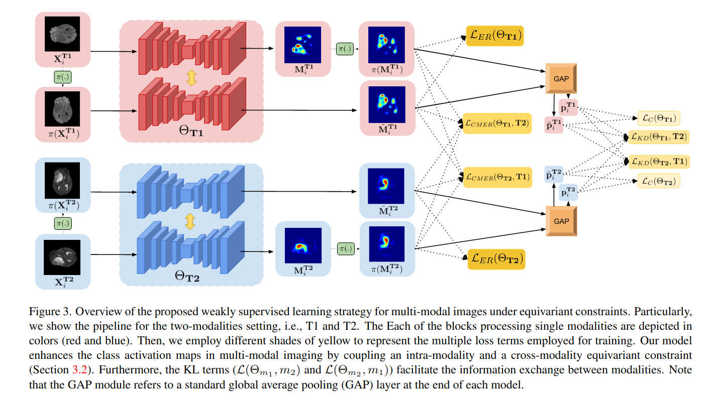

# Weakly-supervised segmentation with cross-modality equivariant constraints

Update 01/22: Paper accepted in [Medical Image Analysis (MedIA)](https://www.journals.elsevier.com/medical-image-analysis) !

Pytorch code for the paper : "Weakly supervised segmentation with cross-modality equivariant constraints", available at https://arxiv.org/pdf/2104.02488.pdf:




## Abstract
Weakly supervised learning has emerged as an appealing alternative to alleviate the need for large labeled datasets in semantic segmentation. Most current approaches exploit class activation maps (CAMs), which can be generated from image-level annotations.  Nevertheless, resulting maps have been demonstrated to be highly discriminant, failing to serve as optimal proxy pixel-level labels.  We present a novel learning strategy that leverages  self-supervision in a multi-modal image scenario to significantly enhance original CAMs.  In particular, the proposed method is based on two observations.  First, the learning of fully-supervised segmentation networks implicitly imposes equivariance by means of data augmentation, whereas this implicit constraint disappears on CAMs generated with image tags. And second, the commonalities between image modalities can be employed as an efficient self-supervisory signal, correcting the inconsistency shown by CAMs obtained across multiple modalities.  To effectively train our model, we integrate a novel loss function that includes a within-modality and a cross-modality equivariant term to explicitly impose these constraints during training. In addition, we add a KL-divergence on the class prediction distributions to facilitate the information exchange between modalities which, combined with the equivariant regularizers further improves the performance of our model. Exhaustive experiments on the popular multi-modal BraTS and prostate DECATHLON segmentation challenge datasets demonstrate that our approach outperforms relevant recent literature under the same learning conditions.


## Getting Started

### Minimum requirements

1. Dependencies :
easydict 1.9
kornia 0.3.1
tensorboardX 2.0
tqdm 4.41.1
graphviz 0.8.4
imageio 2.3.0
matplotlib 2.2.2
numpy 1.14.5
Pillow 5.2.0
scikit-image 0.14.0
scikit-learn 0.19.1
scipy 1.1.0
tensorboardX 1.2
torch 1.4.0
torchvision 0.5.0

 2. Hardware : A 12 GB+ CUDA-enabled GPU for the bi-modal setup. For quad-modality setup a single with 24GB GPU may be required, however, 2-12GB GPUs can be used to train in DataParallel mode. 

### Download data

#### Dataset

1. The BraTS-2019 dataset can downloaded from this [link](https://www.med.upenn.edu/cbica/brats2019/data.html)
2. Our preprocessed and 3-fold cross-validation split of prostate DECATHALON dataset can be downloaded from these links. [Split1](https://purdue0-my.sharepoint.com/:u:/g/personal/pate1332_purdue_edu/EedgwcEyo7hMsLU5rXhTv7ABGHhNN2OxLYXRzYpjKNGnzw?e=zw8y9w), [Split2](https://purdue0-my.sharepoint.com/:u:/g/personal/pate1332_purdue_edu/EQK8lxWv79xArtUlZiQWCpYBZ0f3EezwFMMmJXxbwtJ_Pw?e=0ZfJil), [Split3](https://purdue0-my.sharepoint.com/:u:/g/personal/pate1332_purdue_edu/EWPV_gMHejNHpEqa81qjpwMBFSy4i6MxE8U6uyIzW8naGA?e=rBVASw) . The splits are  **.tar** files which need to be extracted, which can be done by ```tar -xvf <dataset_name>.tar```


Basic dataset folder structure, using Prostate dataset as an exemplary. (Note: Make sure to change the dataset directory accordingly inside the config file )

```
prostate_data_1
	├── train
	│	├── ADC
	│	│   ├── <patient_1>_<slice_1>.png
	│	│  ...
	│	│  ...
	│	│  ...
	│	│   └── <patient_m>_<slice_n>.png
	│	├── GT
	│	│   ├── <patient_1>_<slice_1>.png
	│	│  ...
	│	│  ...
	│	│  ...
	│	│   └── <patient_m>_<slice_n>.png
	│	└── T2
	│	│   ├── <patient_1>_<slice_1>.png
	│	│  ...
	│	│  ...
	│	│  ...
	│	│   └── <patient_m>_<slice_n>.png
	└── val
	    ├── ADC
	    │   ├── <patient_1>_<slice_1>.png
	    │  ...
	    │  ...
	    │  ...
	    │   └── <patient_m>_<slice_n>.png
	    ├── GT
	    │   ├── <patient_1>_<slice_1>.png
	    │  ...
	    │  ...
	    │  ...
	    │   └── <patient_m>_<slice_n>.png
	    └── T2
	        ├── <patient_1>_<slice_1>.png
		...
		...
		...
	        └── <patient_m>_<slice_n>.png
```

## Training(Running the training script) 

```python
python main.py ./configs/experiment_prostate_data_1.json
```

## Citation
Please cite our paper if the code is helpful to your research.
```
@article{patel2021weakly,
  title={Weakly supervised segmentation with cross-modality equivariant constraints},
  author={Patel, Gaurav and Dolz, Jose},
  journal={Medical Image Analysis},
  year={2022}
}
```

## Contact

For further questions or details, please post an issue or directly reach out to Gaurav Patel (gpatel10@purdue.edu)


## Acknowledgments
We gratefully thank the authors of https://github.com/moemen95/Pytorch-Project-Template, as well as https://github.com/YudeWang/SEAM from which some parts of our code are inspired. Also, we would like to thank https://github.com/mboudiaf/RePRI-for-Few-Shot-Segmentation for the README template.


